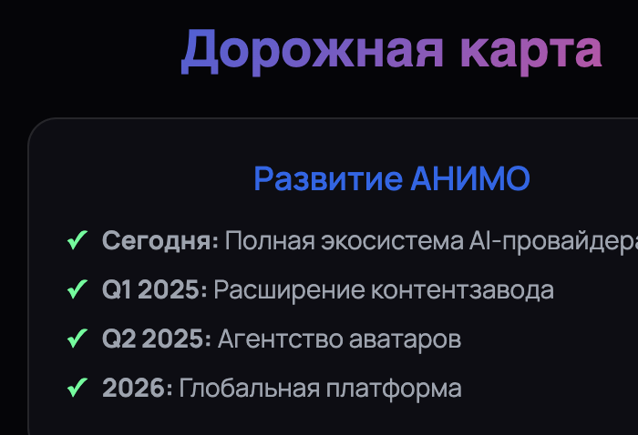

# 🚀 ГИД ПО РАЗВЕРТЫВАНИЮ ANIMO НА GITHUB PAGES

**Дата:** 15 декабря 2025  
**Автор:** MiniMax Agent

---

## 📦 СОДЕРЖИМОЕ АРХИВА

**Файл:** `animo_presentation_github.zip`

**Включает:**
- ✅ `index.html` - основная презентация
- ✅ `styles.css` - все стили презентации
- ✅ `animo_logos.css` - стили логотипов
- ✅ `script.js` - JavaScript функциональность
- ✅ `animo_update.js` - дополнительные скрипты
- ✅ `image.png` - логотип ANIMO

---

## 🎯 ПОШАГОВАЯ ИНСТРУКЦИЯ

### Шаг 1: Создание репозитория
1. Перейдите на [GitHub.com](https://github.com)
2. Нажмите "New repository" (кнопка "+")
3. Название: `animo-presentation`
4. Описание: `AI Infrastructure Provider - Interactive Presentation`
5. Отметьте "Public" (для GitHub Pages)
6. **ВАЖНО:** Поставьте галочку "Add a README file"
7. Нажмите "Create repository"

### Шаг 2: Загрузка файлов
1. Скачайте архив `animo_presentation_github.zip`
2. Распакуйте архив
3. Перейдите в репозиторий на GitHub
4. Нажмите "uploading an existing file" или просто перетащите файлы
5. Загрузите **ВСЕ файлы** из архива:
   - `index.html`
   - `styles.css`
   - `animo_logos.css`
   - `script.js`
   - `animo_update.js`
   - `image.png` (логотип)

### Шаг 3: Настройка GitHub Pages
1. Перейдите в раздел "Settings" репозитория
2. Прокрутите до раздела "Pages"
3. В "Source" выберите "Deploy from a branch"
4. В "Branch" выберите "main"
5. В "Folder" выберите "/ (root)"
6. Нажмите "Save"

### Шаг 4: Настройка корректных путей
**ВАЖНО:** После загрузки файлов нужно исправить путь к логотипу в `index.html`:

1. Откройте `index.html` в редакторе репозитория
2. Найдите строку с логотипом (около строки 200-300)
3. Замените:
   ```html
   
   ```
   На:
   ```html
   
   ```
4. Сохраните изменения (Commit)

---

## ✅ ПРОВЕРКА РАБОТОСПОСОБНОСТИ

### URL презентации
После развертывания ваша презентация будет доступна по адресу:
```
https://[ваше-имя-пользователя].github.io/animo-presentation/
```

### Что проверить:
1. **Загрузка страницы** - должен открыться первый слайд
2. **Навигация** - стрелки между слайдами должны работать
3. **Анимации** - плавные переходы и эффекты
4. **Адаптивность** - проверьте на мобильном устройстве
5. **Логотип** - должен отображаться корректно

---

## 🔧 ВОЗМОЖНЫЕ ПРОБЛЕМЫ И РЕШЕНИЯ

### Проблема: Логотип не загружается
**Решение:** Проверьте, что файл `image.png` загружен в корень репозитория и путь исправлен.

### Проблема: Стили не применяются
**Решение:** Убедитесь, что файл `styles.css` загружен в корень репозитория.

### Проблема: JavaScript не работает
**Решение:** Проверьте, что оба JS файла загружены:
- `script.js`
- `animo_update.js`

### Проблема: GitHub Pages не работает
**Решение:** 
1. Подождите 5-10 минут после настройки
2. Убедитесь, что репозиторий публичный
3. Проверьте настройки Pages в Settings

---

## 🎨 ДОПОЛНИТЕЛЬНЫЕ НАСТРОЙКИ

### Доменное имя (опционально)
Если хотите использовать собственный домен:
1. В настройках Pages добавьте файл `CNAME`
2. В файле укажите ваш домен: `presentation.animo.ai`

### Кастомизация
Для изменения дизайна редактируйте файл `styles.css`:
- Цвета: секция `:root`
- Шрифты: секция `/* Typography */`
- Анимации: секция `/* Animations */`

---

## 📱 МОБИЛЬНАЯ ВЕРСИЯ

Презентация автоматически адаптируется под:
- 📱 **Мобильные устройства** (до 768px)
- 📟 **Планшеты** (768px - 1024px)
- 💻 **Десктоп** (от 1024px)

### Особенности мобильной версии:
- Упрощенная навигация (свайпы)
- Увеличенные кнопки для touch
- Оптимизированные анимации
- Адаптивная типографика

---

## 🚀 ГОТОВО!

После выполнения всех шагов у вас будет:
- ✅ Рабочая презентация ANIMO
- ✅ Доступная по ссылке в интернете
- ✅ Адаптивная для всех устройств
- ✅ Готовая к презентации

**URL примера:** `https://username.github.io/animo-presentation/`

---

## 📞 ПОДДЕРЖКА

Если возникли проблемы:
1. Проверьте консоль браузера (F12) на ошибки
2. Убедитесь, что все файлы загружены в корень репозитория
3. Проверьте правильность пути к логотипу

**Удачи с презентацией! 🎯**